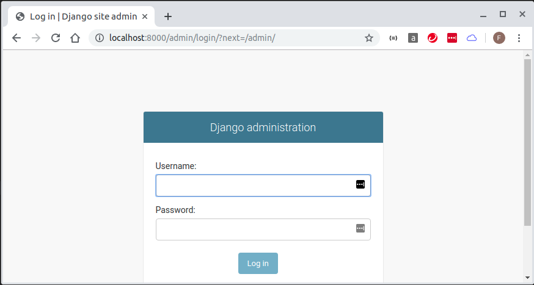
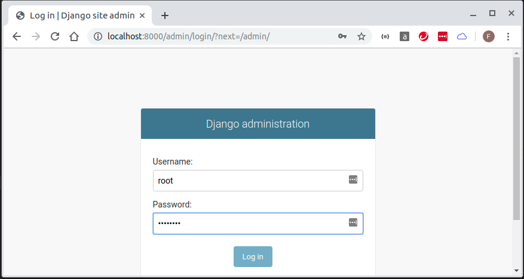
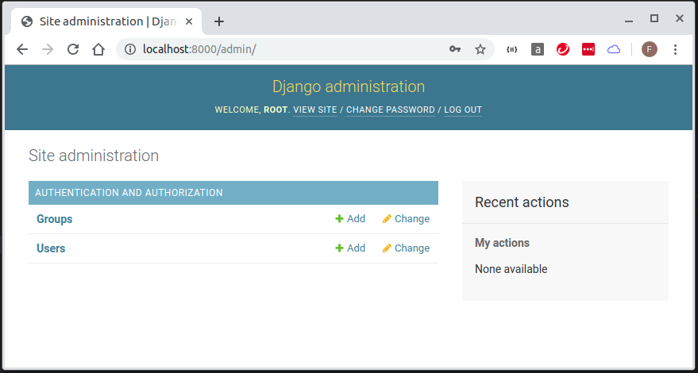
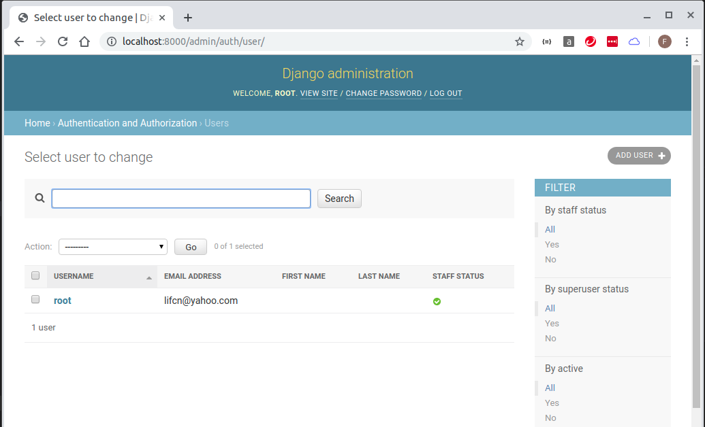

tasks 

* update locallibrary/settings.py to connect to mariadb
* migrate 
* createsuperuser
* test admin page

## migrate buildin databases

```
docker-compose up -d --build

feng@ubuntu:~/docker-django-v3$ sudo docker-compose run web python manage.py migrate
Starting docker-django-v3_db_1 ... done
Operations to perform:
  Apply all migrations: admin, auth, contenttypes, sessions
Running migrations:
  Applying contenttypes.0001_initial... OK
  Applying auth.0001_initial... OK
  Applying admin.0001_initial... OK
  Applying admin.0002_logentry_remove_auto_add... OK
  Applying admin.0003_logentry_add_action_flag_choices... OK
  Applying contenttypes.0002_remove_content_type_name... OK
  Applying auth.0002_alter_permission_name_max_length... OK
  Applying auth.0003_alter_user_email_max_length... OK
  Applying auth.0004_alter_user_username_opts... OK
  Applying auth.0005_alter_user_last_login_null... OK
  Applying auth.0006_require_contenttypes_0002... OK
  Applying auth.0007_alter_validators_add_error_messages... OK
  Applying auth.0008_alter_user_username_max_length... OK
  Applying auth.0009_alter_user_last_name_max_length... OK
  Applying auth.0010_alter_group_name_max_length... OK
  Applying auth.0011_update_proxy_permissions... OK
  Applying sessions.0001_initial... OK
feng@ubuntu:~/docker-django-v3$ 

feng@ubuntu:~/docker-django-v3$ sudo docker-compose run web python manage.py createsuperuser
Starting docker-django-v3_db_1 ... done
Username (leave blank to use 'root'): 
Email address: lifcn@yahoo.com
Password: 
Password (again): 
This password is too common.
Bypass password validation and create user anyway? [y/N]: y
Superuser created successfully.
feng@ubuntu:~/docker-django-v3$ 
```

## test admin page

* test 'http://localhost:8000/admin' 








